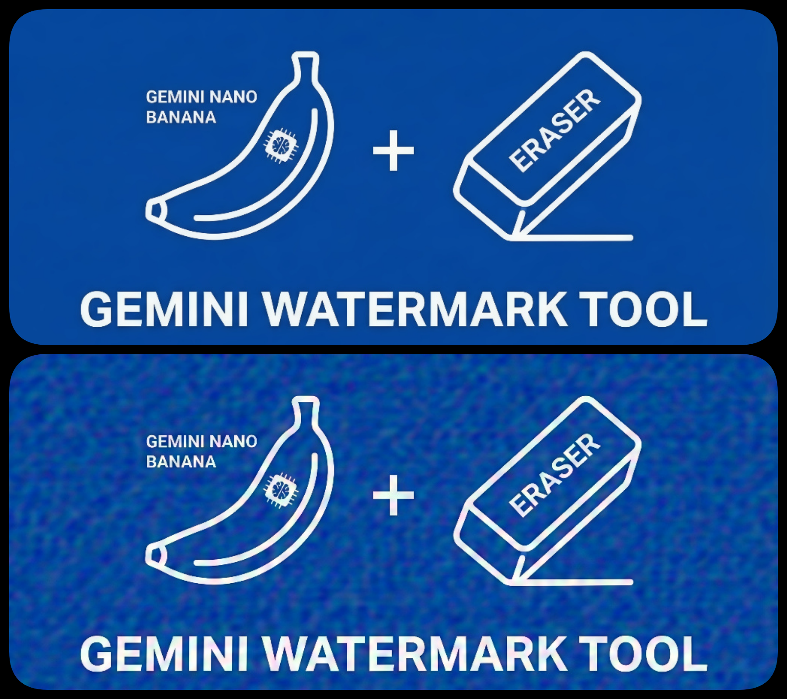
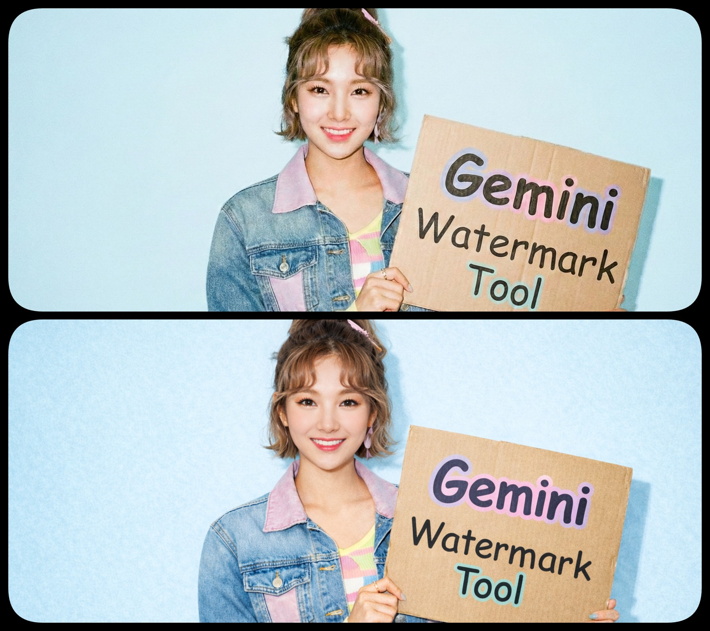

# SynthID Image Watermark Research Report

> **Researchers**: Allen Kuo
> **Date**: December 2025  
> **Status**: Ongoing Research  
> **Conclusion**: SynthID cannot be removed while preserving image quality

---

## Executive Summary

This document records our comprehensive reverse-engineering research into Google's **SynthID** invisible watermarking technology. After extensive experimentation with dozens of attack strategies, we discovered that **SynthID cannot be removed without destroying the image** — not due to technical limitations, but due to the fundamental nature of how SynthID works.

### Key Discovery

> **SynthID is not a watermark added to an image. It IS the image.**

---

## 1. What is SynthID?

SynthID is Google DeepMind's invisible watermarking technology for AI-generated images. Unlike traditional watermarks:

- **Invisible**: Imperceptible to human eyes
- **Robust**: Survives common image transformations
- **Integrated**: Embedded during the generation process, not added afterward

### The Critical Insight

```
[X] Wrong understanding:
   Original Image + SynthID Noise = Final Image
   → If we find and subtract the noise, we recover the original

[V] Correct understanding:
   SynthID = Statistical Bias in the generation process
   → It's not "added" to the image; it IS how the image was created
   → The watermark and the visual content are inseparably bound
```

---

## 2. How SynthID Works

### 2.1 Injection Phase: Tournament Sampling

In standard diffusion models, image generation involves random sampling at each step. SynthID modifies this by using **biased sampling**:

```
Standard:  x_{t-1} = μ_θ(x_t, t) + σ_t · z      (z is random)

SynthID:   x_{t-1} = μ_θ(x_t, t) + σ_t · z*     (z* is selected)

z* = argmax_{z ∈ {z_1,...,z_n}} [ φ(x_{t-1}(z)) · K ]

Where:
  φ(·) = Feature extraction function
  K    = Google's private watermark key
```

**Plain Language**: The model rolls the dice 10 times and picks the result that best matches Google's secret codebook.

### 2.2 Detection Phase: Hypothesis Testing

```
V = φ(Image)                      # Extract features
S = (V · K) / (||V|| · ||K||)     # Compute alignment with key

Decision:
  S < τ_low      → "Not Detected"
  τ_low < S < τ_high → "Part of this image..." 
  S > τ_high     → "Most or all of this image..."
```

### 2.3 The "Style is DNA" Theory

SynthID operates as a **parasite of entropy**:

| Region Type | Entropy | SynthID Capacity |
|-------------|---------|------------------|
| Complex texture (hair, fabric) | High | High — many choices to bias |
| Solid color (background) | Low | None — no choices available |
| Geometric shapes | Low | Minimal |

**Key Insight**: SynthID cannot exist in regions with no variance. This is why extreme quantization (binarization) works.

---

## 3. Experiment Results Summary

### 3.1 Failed Methods (Do NOT Work)

| Method | Why It Fails |
|--------|--------------|
| Negative/Grayscale | Linear transform preserves statistics |
| Physical re-capture | Camera faithfully records the style |
| Gaussian/Uniform noise | Random noise is orthogonal to key |
| Geometric perturbation | SynthID trained with augmentation |
| Frequency domain attacks | Preserves energy distribution |
| Fake SynthID injection | Fake patterns orthogonal to real key |
| AI Super-resolution | Faithfully restores original bias |
| Downscale-upscale | Multi-scale redundancy survives |
| Iterative dilution (1000+) | Orthogonal accumulation ineffective |

### 3.2 Partially Successful Methods

| Method | Result | Notes |
|--------|--------|-------|
| Laplacian noise | "Part of" | Sparse destruction, ~30% affected |
| AI Repaint (low strength) | "Part of" | Referenced regions retain bias |
| Cross-AI repaint (careful) | Unstable | "Golden zone" is extremely narrow |



### 3.3 Successful Methods (With Trade-offs)

| Method | Result | Trade-off |
|--------|--------|-----------|
| True binarization (1-bit) | ✅ Removed | Image becomes skeleton |
| Extreme destruction (PSNR < 25dB) | ✅ Removed | Image filled with artifacts |
| AI Deep Repaint (Denoise > 0.7) | ✅ Removed | Style changes significantly |



---

## 4. The Impossible Triangle

```
                Visual Fidelity
                      △
                     / \
                    /   \
                   /  X  \
                  / Cannot\
                 / achieve \
                /   all 3   \
               /_____________\
        Remove SynthID    Stable/Repeatable
```

**Google's Design Philosophy**:
> "If you want to keep my painting, you must keep my signature.  
> If you want to remove my signature, you must destroy my painting."

---

## 5. Potential Removal Approaches

Based on our research, there are only **three viable paths** to remove SynthID:

### Path 1: Destroy the Canvas (Quantization Attack)

```python
# Extreme quantization eliminates continuous values
# SynthID needs variance to encode bias
_, binary = cv2.threshold(gray, 128, 255, cv2.THRESH_BINARY)
```

- **Pros**: 100% effective
- **Cons**: Image becomes unusable (only outlines remain)
- **Use case**: Line art, text documents

### Path 2: Change the Painter (Generative Attack)

```
Use another AI (Stable Diffusion, Midjourney) to repaint
with high denoising strength (> 0.7)

New pixels come from different probability distribution
V_SD · K_Google ≈ 0 (orthogonal)
```

- **Pros**: Image remains "good looking"
- **Cons**: Style changes; details differ
- **Use case**: When visual similarity is acceptable

### Path 3: White-Box Adversarial Attack (Theoretical)

```
If detector model becomes available:
1. Compute gradient: ∇_image Loss(detector)
2. Apply minimal adversarial perturbation
3. Imperceptible changes flip detection result
```

- **Pros**: Could be imperceptible
- **Cons**: Requires access to detector (not available)
- **Status**: Theoretical only

---

## 6. Mathematical Foundation

### The Essence of SynthID

```
SynthID is a constraint in an optimization problem:

Generate x such that:
  
  L_visual(x) minimized    AND    φ(x) · K > τ
  ───────────────────            ─────────────
     Image looks real            Features match Google's

All attacks attempt to break the RIGHT constraint
while preserving the LEFT (visual quality).

Conclusion:
  Only "changing the painter" or "destroying the canvas"
  can break the right constraint.
```

### Why Random Noise Fails

```
Score' = Σ [ f(original + noise) · K ]
       = Σ [ f(original) · K ] + Σ [ f(noise) · K ]
       = Score + 0

Because: E[f(random) · K] = 0 (orthogonal to key)
```

### Why AI Repaint Works

```
Low Denoising (0.3):
  x_new = 0.8 · x_Google + 0.2 · x_SD
  V_new · K ≈ 0.8 · (V_Google · K) > τ → "Part of"

High Denoising (0.9):
  x_new = 0.1 · x_Google + 0.9 · x_SD  
  V_new · K ≈ 0.1 · (V_Google · K) < τ → Not Detected
```

---

## 7. Conclusions

### What We Learned

1. **SynthID is not a watermark** — it's a statistical bias embedded during generation
2. **The watermark IS the image** — they cannot be separated without destruction
3. **Random attacks are futile** — orthogonal to the detection key
4. **Only two approaches work**: destroy the image or repaint it with another AI

### Recommendations

| Goal | Recommended Approach |
|------|---------------------|
| Remove for line art | Binarization |
| Remove for photos | AI repaint with high denoising |
| Remove invisibly | Not currently possible |

### Future Research Directions

1. **Quantization threshold discovery** — find minimum bit depth where SynthID fails
2. **Dithered quantization** — maintain visual quality with discrete values
3. **Selective processing** — only process high-entropy regions
4. **Transfer attacks** — train surrogate detector for adversarial samples

---

## 8. References

1. Google DeepMind - "SynthID: Identifying AI-generated content"
2. "Watermarking for Probabilistic Generative Models" - Google DeepMind
3. "Tree-Ring Watermarks: Fingerprints for Diffusion Images" - Related research
4. Gemini 3 Pro technical analysis (conversation records)

---

## Disclaimer

This research is conducted for **educational and academic purposes only**. The goal is to understand the robustness of AI watermarking technologies, not to facilitate misuse.

SynthID represents a significant advancement in AI content authentication. Our research demonstrates its remarkable resilience and validates Google's design goals.

## Related

- [SynthID Image Watermark Research Report](https://allenkuo.medium.com/synthid-image-watermark-research-report-9b864b19f9cf)
---

*For more detailed analysis, see our upcoming Medium article.*

*Last Updated: December 2024*
